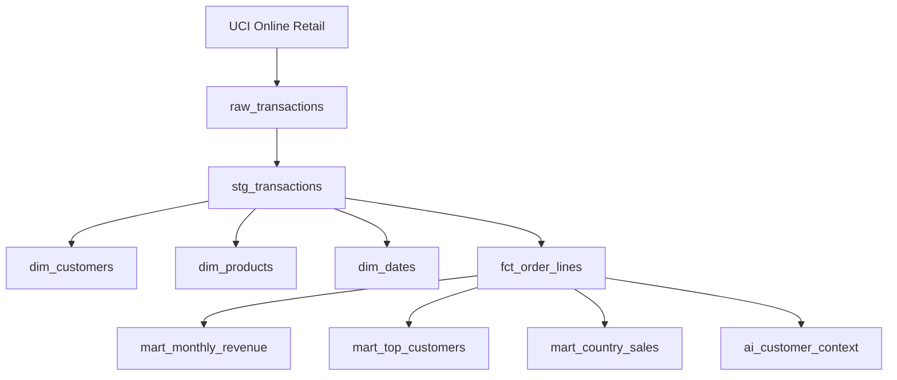

```mermaid
flowchart TD
    A[UCI Online Retail] --> B[raw_transactions]
    B --> C[stg_transactions]
    C --> D[dim_customers]
    C --> E[dim_products]
    C --> F[dim_dates]
    C --> G[fct_order_lines]
    G --> H[mart_monthly_revenue]
    G --> I[mart_top_customers]
    G --> J[mart_country_sales]
    G --> K[ai_customer_context]
```